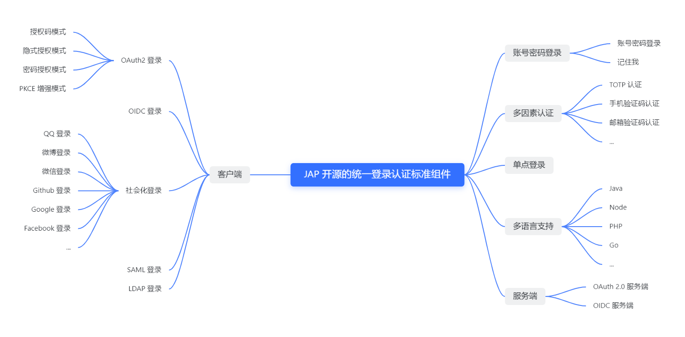

	

	<strong>Just auth into any app</strong>

	<a target="_blank" href="https://search.maven.org/search?q=jap">
	  </img>
	</a>
	<a target="_blank" href="https://gitee.com/yadong.zhang/JustAuth/blob/master/LICENSE">
	  </img>
	</a>
	<a target="_blank" href="https://apidoc.gitee.com/fujieid/jap" title="API文档">
	  </img>
	</a>
	<a target="_blank" href="https://justauth.plus" title="开发文档">
	  </img>
	</a>
  <a target="_blank" href="https://codecov.io/gh/fujieid/jap" title="开发codecov档">
	  </img>
	</a>
  <a target="_blank" href="https://travis-ci.com/fujieid/jap" title="开发codecov档">
	  </img>
	</a>
	<a target="_blank" href="https://gitter.im/fujieid/JAP?utm_source=badge&utm_medium=badge&utm_campaign=pr-badge">
	  </img>
	</a>

  <a target="_blank" href='https://gitee.com/fujieid/jap/stargazers'>
    </img>
  </a>
  <a target="_blank" href='https://github.com/fujieid/jap/stargazers'>
    </img>
  </a>

	<strong>开源地址：</strong> <a target="_blank" href='https://gitee.com/fujieid/jap'>Gitee</a> | <a target="_blank" href='https://github.com/fujieid/jap'>Github</a> | <a target="_blank" href='https://codechina.csdn.net/fujieid/jap'>CodeChina</a>

	<strong>社区论坛：</strong> <a target="_blank" href='https://discuss.justauth.plus'>https://discuss.justauth.plus</a>

	<strong>开发者中心：</strong> <a target="_blank" href='https://justauth.plus'>https://justauth.plus</a>

## 🎨 JAP 是什么？

JustAuthPlus（以下简称"**JAP**"）是一款开源的登录认证中间件，基于模块化设计，为所有需要登录认证的 WEB 应用提供一套标准的技术解决方案，开发者可以基于 JAP 适配绝大多数的 WEB 系统（自有系统、联邦协议），就像集成 [JustAuth](https://gitee.com/yadong.zhang/JustAuth) 一样，简单方便。

- JAP 口号：Just auth into any app!
- JAP 目标：让身份链接无处可藏
- JAP 价值：方便开发者无缝对接绝大多数第三方应用或者自有系统，提高开发效率，减少代码维护成本
- JAP 愿景：使之成为开发者生态内必不可少的“基础设施”，以期形成新的技术标准。

**ps：我们要让开发者可以基于 JAP 开发出自己的 IAM 或者 IDaaS 系统。Build your own IDaaS/IAM.**

## ✨ JAP 有什么特性？

- **易用性**：JAP 的 API 沿袭 JustAuth 的简单性，做到了开箱即用的程度。JAP 高度抽象各种登录场景，提供了多套简单使用的 API，极大程度的降低了开发者的学习成本和使用成本 
- **全面性**：JAP 全量适配 JustAuth 支持的第三方平台，实现第三方登录。同时也支持所有基于标准OAuth2.0 协议或者 OIDC 协议或者 SAML 协议的应用、系统，同时 JAP 还提供不同语言版本的项目 SDK，适配多种研发场景
- **模块化**：JAP 基于模块化设计开发，针对每一种登录场景，比如账号密码、OAuth、OIDC等，都单独提供了独有的模块化解决方案
- **标准化**：JAP 和业务完全解耦，将登录认证相关的逻辑抽象出一套标准的技术解决方案，针对每一种业务场景，比如用户登录、验证密码、创建并绑定第三方系统的账号等，都提供了一套标准的策略或者接口，开发者可以基于 JAP，灵活并方便的完成相关业务逻辑的开发和适配
- **通用性**：JAP 不仅可以用到第三方登录、OAuth授权、OIDC认证等业务场景，还能适配开发者现有的业务系统的普通账号密码的登录场景，基本将所有登录相关的业务场景都已经涵盖。针对 WEB 应用，JAP 将提供满足各种不同登录场景的解决方案（和开发语言无关）

## 🎯 JAP 有什么功能？

## 💥 适用于哪些场景？

JAP 适用于所有需要登录功能的场景。比如：
- **要求规范**：新项目立项，你们需要研发一套包含登录、认证的系统，并且从长远方面考虑，你们需要一套标准的、灵活的、功能全面的登录认证功能。
- **需求灵活**：现有登录模块为自研，但是新一轮的技术规划中，你们想将登录认证模块重构，以更加灵活的架构适应后面的新需求，比如：集成 MFA 登录、集成 OAuth 登录、SAML登录等。
- **力求省事**：你们的项目太多（或者是开发语言较多，比如：Java、Python、Node 等），每个项目都需要登录认证模块，想解决这种重复劳动的问题，使研发人员有更多的时间和精力投入到业务开发中，提高研发产能和研发效率。
- ...

## ❓ JAP 常见问题有哪些？

### ❔ JAP 不支持具体的业务操作吗？

JAP 针对用户、应用等业务数据，只提供标准的业务接口，不提供数据库层面的支持。JAP 要做的是为广大开发者提供一套技术标准，既然是标准，那就不能依赖于任何和具体业务相关的逻辑。不管你们的系统是用的 MySQL、Oracle、SQLlite、Redis、MongoDB 还是其他的，JAP 通通不关心。JAP 对外提供标准接口，业务端只需要按需实现 JAP 的接口即可，这种设计能在最大程度上增加它的灵活性，使它不受限于某一具体的数据库实现方案。

### ❔ JAP 可以用到企业级项目吗？

当然，JAP 的价值就在于：**方便开发者无缝对接任何第三方应用或者自有系统，提高开发效率，减少代码维护成本**。所以对于企业来说，这是一个降本增效的功能。JAP 基于模块化开发，并且不侵入业务系统，可以十分方便的集成到企业内部各个系统或者统一的登录认证网关中。

### ❔ JAP 可以商用吗？

JAP 基于 LGPL 3.0 协议。商用分为以下两种情况：

- LGPL **允许商业软件通过类库引用(link)方式使用**而不需要开源商业软件的代码。这使得**采用 LGPL 协议的开源代码可以被商业软件作为类库引用并发布和销售**。
- 如果修改 LGPL 协议的代码或者衍生，则所有修改的代码，涉及修改部分的额外代码和衍生的代码都必须采用 LGPL 协议。因此 LGPL 协议的开源代码**不适合通过修改和衍生的方式做二次开发的商业软件采用**。

## 🚀 开源推荐
- `JustAuth` 开箱即用的整合第三方登录的开源组件: [https://github.com/justauth/JustAuth](https://github.com/justauth/JustAuth)
- `spring-boot-demo` 深度学习并实战 spring boot 的项目: [https://github.com/xkcoding/spring-boot-demo](https://github.com/xkcoding/spring-boot-demo)
- `mica` SpringBoot 微服务高效开发工具集: [https://github.com/lets-mica/mica](https://github.com/lets-mica/mica)
- `pig` 宇宙最强微服务认证授权脚手架(架构师必备): [https://gitee.com/log4j/pig](https://gitee.com/log4j/pig)
- `SpringBlade` 完整的线上解决方案（企业开发必备）: https://gitee.com/smallc/SpringBlade

## 🏘️ 加入社群

## 🏘️ 加入开发者组织

[参考文章](https://justauth.plus/community/weneed.html)

## 👪 贡献者列表

## 💹 关注统计

### Gitee

    

### Github

    

### Product Hunt

